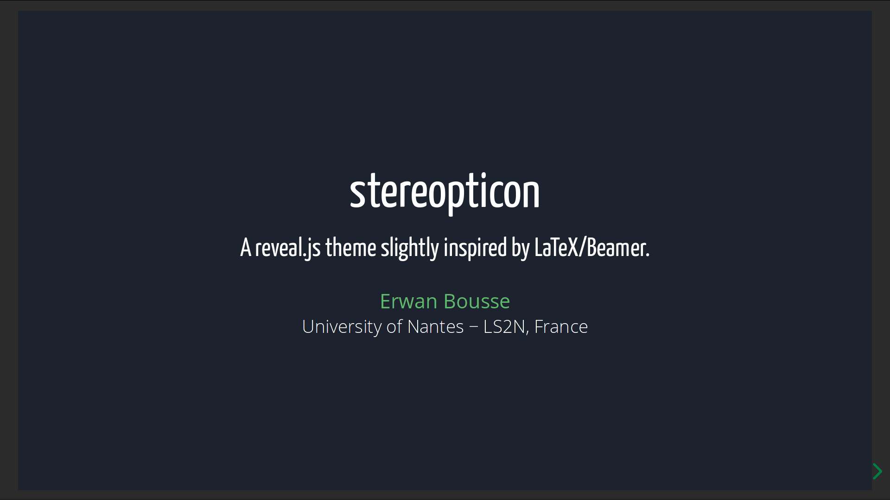

= Stereopticon

A *reveal.js theme* slightly inspired by LaTeX/Beamer.

image::screenshots/slide.png[Example of slide.]

== Usage in an existing reveal.js project

- Copy the `css` and `lib` folders inside a `revealjs` installation folder, and say *yes* when asking to merge the folders.
- Go in the `revealjs` folder and run: `npm install && npm run build -- css-themes`, which will produce `revealjs/css/theme/stereopticon.css`.
- Now this `revealjs` folder has a new theme called `stereopticon` which can be used as any other theme.

For the theme to work correctly, the following reveal.js options *must* be set:
----
center: false,
display: 'flex',
width: "100%",
height: "100%",
----

The option `margin: 0` is not mandatory but is recommended in order to have a complete fullscreen display.

== Development and testing

In a dev environment, to test the theme:

- Run `compile.sh` that will:
    * clone reveal.js,
    * create symbolic links, in order to add stereopticon to the cloned reveal.js,
    * compile all reveal.js themes (including ours).
- Run `ruby -run -e httpd . -p 5000 -b 127.0.0.1` to start a web server.
- Open `http://localhost:5000/demo.html`, which points to our compiled theme, and admire the result.

_Optional: if working in a VSCode environment, use the https://github.com/wk-j/vscode-save-and-run[Save and Run] extension to automatically run `compile.sh` after each SCSS file change._