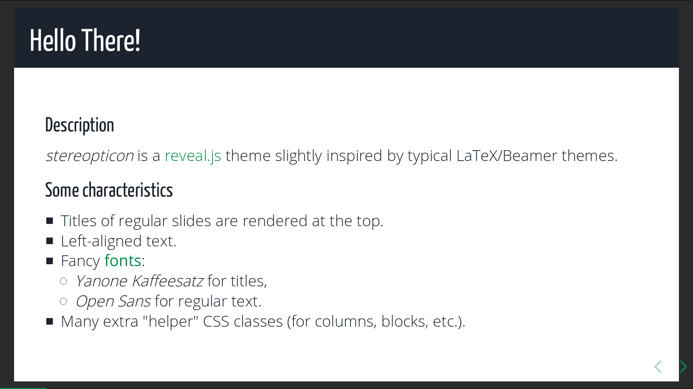

= Stereopticon

A *reveal.js theme* slightly inspired by LaTeX/Beamer.

Demo available https://bousse-e.univ-nantes.io/stereopticon/demo.html[here].

[role="thumb"]
image::screenshots/title.png[Example of title slide., 100%]

[role="thumb"]

== Compilation and usage in an existing reveal.js project

- Copy the `css` and `lib` folders inside a `revealjs` installation folder, and say *yes* when asking to merge the folders.
- Go in the `revealjs` folder and run: `npm install && npm run build -- css-themes`, which will produce `revealjs/css/theme/stereopticon.css`.
- Now this `revealjs` folder has a new theme called `stereopticon` which can be used as any other theme.

For the theme to work correctly, the following reveal.js options *must* be set:
----
center: false,
display: 'flex',
width: 1920,
height: 1080,
----

The option `margin: 0` is not mandatory but can be used to remove the dark gray frame around slides.

== Development and testing

To dev and test the theme:

- Run `compile.sh` that will:
    * clone reveal.js,
    * create symbolic links, in order to add stereopticon to the cloned reveal.js,
    * compile all reveal.js themes (including ours).
- Start a web server with `python -m SimpleHTTPServer 8080` or `ruby -run -e httpd . -p 8080 -b 127.0.0.1` or even better with https://github.com/tapio/live-server  to have live-reload each time files are modified.
- Open `http://localhost:8080/demo.html`, which points to our compiled theme, and admire the result.

_Optional: if working in a VSCode environment, use the https://github.com/wk-j/vscode-save-and-run[Save and Run] extension to automatically run `compile.sh` after each SCSS file change. Combined with https://github.com/tapio/live-server[live server] this is amazing._